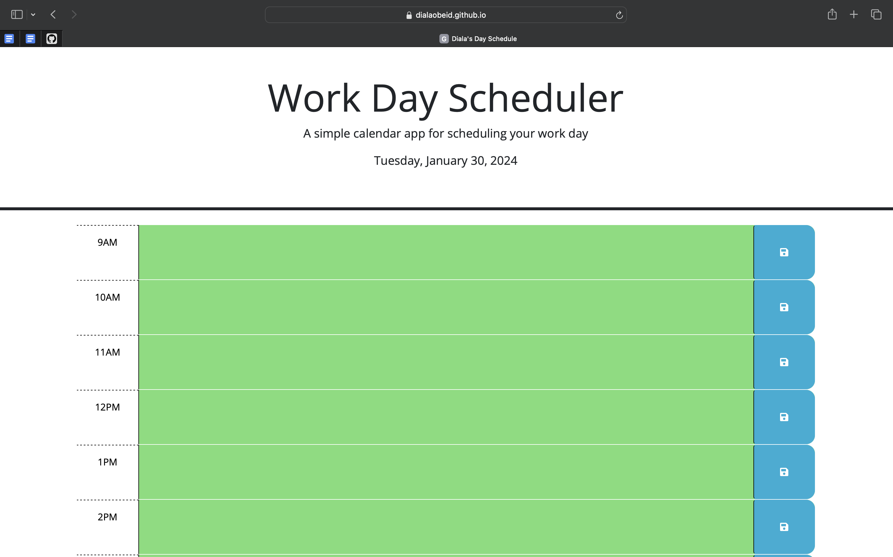

# Dialas-Day-Schedule
Project description:

This challenge requires us to create a simple calendar application that allows a user to save events for each hour of a typical working day (9am-5pm) by modifying starter code. This app will run in the browser and feature dynamically updated HTML and CSS powered by jQuery.
The app will have a clean, polished, and responsive user interface which should also include the following criteria:
```
GIVEN I am using a daily planner to create a schedule
WHEN I open the planner
THEN the current day is displayed at the top of the calendar
WHEN I scroll down
THEN I am presented with time blocks for standard business hours of 9am to 5pm
WHEN I view the time blocks for that day
THEN each time block is color-coded to indicate whether it is in the past, present, or future
WHEN I click into a time block
THEN I can enter an event
WHEN I click the save button for that time block
THEN the text for that event is saved in local storage
WHEN I refresh the page
THEN the saved events persist
```
Created my code with some assistance from Xpert learning assistant and google.

Screenshot: 

Link to github repository for this project: https://github.com/dialaobeid/Dialas-Day-Schedule

Link to deployed application: https://dialaobeid.github.io/Dialas-Day-Schedule/